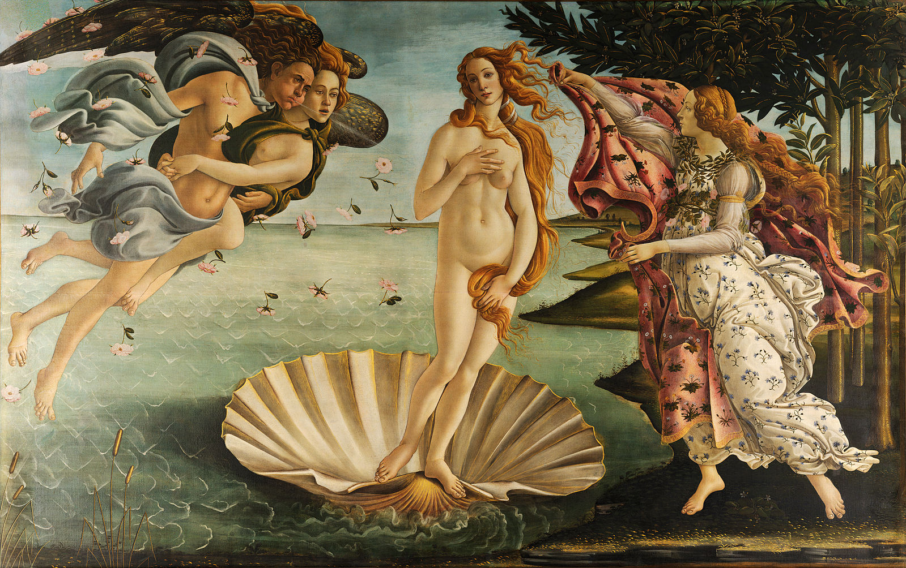
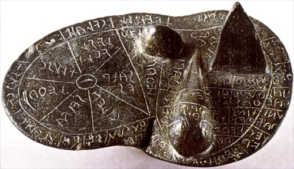

2. Which of the following languages are *not* an immediate source of English anatomical terminology, according to Turmezei (2012)?
    a. Latin and Greek
    b. Arabic
    c. **Hittite**
    d. Middle Dutch
    e. Old English

---

3. What is a *suffix*?
    a. a stem adjoined to a root in order to produce a mitochondrion
    b. **a morpheme added at the end of a word to form a derivative**
    c. an element placed at the beginning of a word to adjust or qualify its meaning

## II. Dissect

Analyse the following words and give the meanings of the elements. E.g. *dissection*: dis/sect/ion = apart from / cut / action suffix.

## anaesthetize

> - an/aesthet/ize, not/feeling/to do = 3 marks

## parabolic

> - para/bol/ic, by the side of/a throw/pertaining to, like = 3 marks

## allochiria

> - allo/chir/ia, other or different/hand/quality or condition = 3 marks

## protagonist

> - prot/agon/ist, first/contest/agent = 3 marks

## epidermoid

> - epi/derm/oid, upon or on/skin/in the shape of = 3 marks

## dichromatism

> - di/chromat/ism, twice/colour/result of action, condition = 3 marks

## III. Match

Indicate the correct definition of the following words and provide their Greek and Latin roots.

## laparoscopy
a. a surgical incision into the abdominal cavity, for diagnosis or in preparation for major surgery
b. a low caesarian section
c. **a surgical procedure in which a fibre-optic instrument is inserted through the abdominal wall to view the organs in the abdomen**
    
- Derivation
    - laparo/scopy, abdomen/to view (3 marks)

## hydrotropism
a. absence of the sense of smell
b. **response to stimulus of water**
c. inflammation of the urinary bladder

- Derivation
    - hydro/trop/ism, water/turn/condition of (4 marks)
    
## malacology
a. **the branch of zoology that deals with molluscs**
b. the branch of zoology that deals with the malacca
c. the branch of biology that deals with the relations of malachites to their surroundings

- Derivation
    - malaco/logy, soft/science of (3 marks)
    
## IV. Define

Provide the definition of the following Greek stems (worth 1 point each).

## 1. ENNE(A)-

> - ‘nine’

## 2. PTO-

> - 'to fall'

## 3. -idium

> - 'little'

## 4. ISCH-

> - ‘to suppress’

## 5. LIP-
> - ‘fat’

## 6. THANAT-

> - ‘death’

# Anatomical Terminology

## Overviews

- [Sakai (2007)](http://dx.doi.org.myaccess.library.utoronto.ca/10.1111/j.1447-073X.2007.00180.x), a summary of development from ancient times to the present day
- [Kachlík et al. (2008)](http://link.springer.com/10.1007/s00276-008-0357-y): discussion of modern attempts to standardize nomenclature.
- [Dirckx (2006)](http://dx.doi.org/10.1016/B0-08-044854-2/04268-1): summary of premodern influences. (*assigned later in the term*)

## Stages of Development (Sakai)

1. Classical and medieval discussions of anatomy.
2. Vesalius (16th century).
3. Later 16th century: development of more specific anatomical terms (Sylvius in Paris and Bauhin in Basel).
4. 17th century, gradually improved Latin anatomical textbooks; in modern languages in 18th and 19th centuries. Different names used for the same thing by many authors.
5. End of the 19th century: *Nomina anatomica*, the first internationally recognized code of anatomical terminology. Revised on many occasions: today's equivalent is the *Terminologia anatomica*.

## *Terminologia Anatomica*

- The standard reference work for anatomical terminology, in Latin and English.
- Completed in 1998 by the Federative Committee on Anatomical Terminology.
- Some naturally feel that it is incomplete, as for example argued by [Matusz (2010)](http://dx.doi.org/10.1002/ase.133); [Gest, Burkel, and Cortright (2009)](http://dx.doi.org/10.1002/ase.90).
- Not always followed consistently, especially in North America: see [Martin et al. (2014)](http://dx.doi.org/10.1155/2014/950898).

# Reading Practice

## μακρός
> - makros (long)
> - macrobiotic, macroeconomics

## θέσις
> - thesis (placing, a proposition)

## χάος
> - khaos (vast chasm, void)
> - chaos, chaotic, gas (with Dutch g representing Greek kh)

## τρόπαιον
> - tropaion (monument of an enemy's defeat)
> - trophy

## ἄλφα
> - alpha

## ἀνάλογος
> - analogos (proportionate)

## ἀναλφάβητος
> - analphabētos (uneducated)

## Ἄτλας
> - Atlas

## ἐνέργεια
> - energeia (energy)

## κρυπτός
> - kruptos (hidden)

## ἐλαστικός
> - elastikos (elastic)

## ἀναχρονισμός
> - anakhronismos (wrong time reference)
> - anachronism

## μαθηματικός
> - mathēmatikos (fond of learning)
> - mathematical, polymath

## ἄνθρωπος
> - anthrōpos (human being)

## ἄνθραξ
> - anthrax

## στροφή
> - strophē (turning)
> - catastrophe (from cata-, 'down')

# Unusual Usage

## Terms from Classical Mythology

- Scientists in the past were often historians, theologians, or literary scholars as well as students of the natural scientists, so naturally they have things names after things they recognized.
- For more, see [Karenberg (2012–13)](http://www.anatomy.org.tr/issue/201301/pdf/05.pdf).

## ammonia

- In mythology
    - Ἄμμων: Amun was a supreme god of the ancient Egyptians, identified with the sun god Ra, and in Greek and Roman times with Zeus and Jupiter (under the name Ammon).
- In science
    - a colourless gas with a characteristic pungent smell, which dissolves in water to give a strongly alkaline solution
- Why? The *OED* suggests: 'The corruption to *armoniac* found in medieval Latin, French, and English, was perhaps due to an association with the Greek ἁρμονία fastening or joining, from the use of gum ammoniac as a cement, or of sal ammoniac in the joining of metals.'

---

](../images/Museo_Barracco_-_Giove_Ammone_1010637.JPG)

## hermaphrodite

- In mythology
    - Hermaphroditus was a son of Hermes and Aphrodite, with whom the nymph Salmacis fell in love and prayed to be forever united.
    - As a result Hermaphroditus and Salmacis became joined in a single body which retained characteristics of both sexes.
- In science
    - a person or animal having both male and female sex organs or other sexual 

## narcissism

- In mythology
    - Narcissus was a beautiful youth who rejected the nymph Echo and fell in love with his own reflection in a pool. He pined away and was changed into the flower that bears his name.
- In science
    - excessive interest in or admiration of oneself and one's physical appearance

## aphrodisiac

- In mythology
    - from Aphrodite (Venus), the goddess of beauty, fertility, and sexual love
- In science
    - a food, drink, or other thing that stimulates sexual desire:

---

## Achilles tendon

- In mythology
    - Achilles was a hero of the Trojan War, son of Peleus and Thetis. During his infancy his mother plunged him in the Styx, thus making his body invulnerable except for the heel by which she held him.
    - During the Trojan War Achilles killed Hector but was later wounded in the heel by an arrow shot by Paris and died.
- In science
    - the tendon connecting calf muscles to the heel.
- Achilles heel: a weakness or vulnerable point. Said to have been so named by Philip Verheyen, but this may be apocryphal.

---

## Words and the History of Science

- The *humours* (Latin, *humor*) were originally bodily fluids: this sense survives in 'aqueous humour' and 'vitreous humour', and were thought to affect one's mood.
    - Four humours: blood, phlehm, yellow bile (*chole*), black bile (*melan chole*).
    - Thus the terms 'choleric', 'melancholy' (literally an excess of black bile).
- This is how the practice of bloodletting seemed to make sense. (See [BBC *Blood and Guts*, ep. 5](https://www.youtube.com/watch?v=ErpMhBiVyrc#t=1m35s), starting about 1m35s.)

---

- *Disaster* literally means 'ill-starred'.
- A *lunatic* was so called because it was thought that the moon caused temporary insanity.
- The term *jovial* apparently comes from a supposition that those born under the planet Jupiter were good-tempered because of its influence.

---

 ](../images/nature-forging-baby.jpg)

---

## Autopsy

- *autos* ‘self’ + *optos* ‘seen’ (i.e. 'personal observation')
- Widely practised, contrary to popular belief, [before the modern era](http://news.harvard.edu/gazette/story/2011/04/debunking-a-myth/).

---

](../images/nero-dissection.jpg)

---

## Figurative Usage

## Delirium

- from Latin *delirare* ‘deviate, be deranged’ (literally ‘deviate from the furrow’), from *de-* ‘away’ + *lira* ‘ridge between furrows’ (i.e. in ploughing a field)

## Muscle

- from Latin *musculus*, diminutive of mus ‘mouse’ (some muscles being thought to be mouse-like in form)

## Cancer

- from Latin, ‘crab or creeping ulcer’, translating Greek *karkinos*, said to have been applied to such tumours because the swollen veins around them resembled the limbs of a crab.
- *canker* was the usual form until the 17th century.

## Acetabulum

- in modern Anatomy, the socket of the hip bone, into which the head of the femur fits.
- in Zoology, any cup-shaped structure, especially a sucker.
- from Latin, *acetum* ‘vinegar’ + *-abulum*, denoting a container.

## Anthrax

- Greek *anthrax, anthrak-* ‘coal, carbuncle’, with reference to its appearance of fiery red pustules.

## Inoculate

- Originally used in horticulture: from Latin *inoculat-* ‘engrafted’, from the verb *inoculare*, from *in-* ‘into’ + *oculus* ‘eye, bud’.
- The sense ‘vaccinate’ (i.e. injecting) dates from the early 18th century.

# Key Roots

## BRACHY-
> - 'short'
> - BRACHY-ODONT or BRACHY-DONT, a molar tooth with a low crown; BRACHY-PODUS; BRACHY-logy, concise or shortened expression

## CAC-, (KAK-)
> - 'bad'
> - CACO-PHON-y; CAC-AESTHE-sia, any morbid sensation; CAC-OSM-ia, imaginary odours, particularly putrefactive odours

## CAU-, CAUS-
> - 'to burn'
> - CAUS-tic; en-CAUS-tic; CAUM-AESTHE-sia, experience of a sense of heat when temperature is not high; CRYO-CAUT-ery, the destruction of tissues by application of extreme cold; CAUT-er-ize to apply an agent capable of burning or destroying tissue

## LOG-
> - 'word', 'speech', 'reason'
> - ana-LOG-ous; dys-LOG-ia, difficulty in expression of words by speech; LOGO-PLEG-ia, loss of power of uttering articulate speech

## MES-
> - 'middle'
> - MESO-POTAM-ia; MESO-PHYTE, plant thriving in a temperate climate with a normal amount of moisture; MESO-POD-ium; middle part of the molluscan foot

## PETR-
> - 'rock'
> - PETR-OL-eum; PETER; PETRO-philous, attached to or living on rocks, especially used of marine life

## PHON-
> - 'sound', 'voice'
> - TELE-PHONE; BARY-PHON-ia a heavy or deep quality of voice; RHINO-PHON-ia, nasal tone in the speaking voice

## PHOT-
> - 'light'
> - PHOTO-GRAPH; PHOTO-LY-tic, of a substance which is decomposed by action of light; PHOTO-TROPH-ic, requiring light as a source of energy in nutrition

## POIE-
> - 'to make'
> - PO-et; ONOMATO-POE-ia; ANGIO-POIE-sis, the process by which certain cells cause the formation of blood vessels in new tissue; HIDRO-POIE-sis, formation of sweat

## PRESBY-
> - 'old'
> - PRESBY-CUS-is, progressive hearing loss occurring with age; PRESBYO-PHREN-ia, failure of the sense of location and memory in the aged

## PYR-, PYRET-; PYREX-
> - 'fire', 'fever'; 'fever'
> - PYRETO-GEN-ic, causing fever; PYRETO-lysis, reduction of fever

## GLAUC-
> - 'silvery', 'grey-green'
> - a-GLAUC-OP-sia, green-blindness

## (H)APT-; (H)APH-
> - 'to touch'; 'sense of touch'
> - HAPH-ALGE-sia, a sensation of pain experience on the mere touching of an object; HAPT-ics, the branch of psychology dealing with the tactile sense; syn-APSE, the region of connection between two neurons

## KERAT-, CERAT-, KER-, CER-
> - 'horn', 'horny tissue', 'cornea'
> - RHINO-CER-os; BRACHY-CER-ous, short-horned, or with short antennae; KERAT-oma, a horny thickening of the skin; KERATO-MALAC-ia, softening of the cornea

## ONC-, -ONCUS
> - 'tumour', 'swelling'
> - ONCO-logy; ADEN-ONCUS, an enlargement or tumour of a gland; par-OPTHALM-ONC-osis, development of tumour near the eye

## PHRA-
> - 'to speak'
> - PHRA-se; para-PHRA-se; peri-PHRA-sis; a-PHRA-sia, loss of power to utter connected phrases; em-BOLO-PHRA-sia, insertion of meaningless words into speech, embololalia

## PNEUM-, PNEUMAT-
> - 'air', 'gas'
> - PNEUMAT-iz-ation, progressive development of, or state of having, air-filled cavities in the bone
> - related to PNEUMON-, 'lung'

## PORPHYR-
> - 'purple'
> - PORPHYR-in, a heterocyclic ring derived from porhin, named for its deep-red or purple colour; PORPHYR-in-uria, the excretion in the urine of an abnormal amount of porphyrin

## SARC-
> - 'flesh'
> - SARCO-PHAG-us; SARCO-BI-ont, living on flesh; SARCO-CARP, the fleshy or pulpy part of a fruit

## SCLER-
> - 'hard'
> - SCLER-osis; SCLER-a, the sclerotic coat of the eyeball, i.e., the firm fibrous outer layer of the eyeball; SCLERO-MENINX, dense fibrous lining of the cranial cavity and spinal canal, dura mater

## SEP-
> - 'to rot', 'to putrefy'
> - a-SEP-tic, pertaining to the exclusion of microorganisms causing decay; anti-SEP-tic, preventing SEP-sis or poisoning by destruction of or exclusion of microorganisms from body tissue

## SIT-
> - 'food'
> - para-SITE; apo-SIT-ia, aversion to or loathing of food; SITO-therapy, the use of food for therapeutic purposes, a.k.a. DIETO-therapy; SITO-TROP-ism, tendency to turn in the direction of food

## STEN-
> - 'narrow'
> - STENO-GRAPH-y, shorthand; STENO-COR-iasis, narrowing of the pupil; STENO-STOMAT-ous, narrow-mouthed

## HAPL-
> - 'single', 'simple'
> - HAPLO-id, have the number of chromosomes characteristic of mature germ cells for the organism in question; HAPL-OP-ia, single vision, as opposed to DIPL-OP-ia

## ORNIS-, ORNITH-
> - 'bird'
> - ORNITHO-logy; HELI-ORNITH-idae, a family of tropical aquatic birds comprising the sun grebes; ORNITHO-philous, of flowers pollinated through the agency of birds

## PALAE- (PALE-)
> - 'old', 'ancient'
> - PALAE-ONTO-logy; PALAEO-GRAPH-y; PALAEO-ENCEPHAL-on, the phylogenetically old part of the brain

## -PLO-
> - 'folded', 'fold' (as in 'threefold')
> - DI-PLO-ma; DI-PLO-m-at; DI-PLO-CEPHAL-us, an organism with two heads; HETERO-PLO-id, not having a multiple of the basic HAPLO-id number of chromosomes; TETRA-PLO-id, with four times the normal haploid number of chromosomes

## STETH-
> - 'chest'
> - MESO-STETH-ium, middle part of the sternum in vertebrates; MICRO-STETHO-PHONE, a STEHO-SCOPE that amplifies the sounds heard

## XEN-
> - 'host', 'stranger', 'foreigner'
> - XENO-phobia; peri-XEN-itis, inflammation around a foreign body embedded in the tissues; XENO-CHROMA, the effect of foreign pollen producing a change in colour of fruit; XENO-LITH, a fragment of a rock included in another rock

## CARP-
> - 'wrist'
> - CARP-itis, arthritis of the carpal join in domestic animals; CARP-ectomy, excision of a carpal bone or bones; meta-CARP-al, part of hand between carpus and phalanges
- **NB**: CARP- can also mean 'fruit' (different Greek word). 'Carpal tunnel syndrome' <!-- --> refers to the wrist, but a 'carpel' (Gk. *karpos*) is the female reproductive organ of a flower. 

## ECH-
> - 'echo', 'repetition'
> - ECHO-ACU-sia, the subjective sensation of hearing echoes following sounds heard normally; ECHO-LAL-ia, the meaningless repetition of words spoken by others

## GANGLI-
> - 'mass of nerve tissue', 'small cyst or swelling'
> - DI-PLO-GANGLI-ate, with ganglia in pairs; GANGLIO-CYTE, a ganglion cell outside the central nervous system
> - Greek *ganglion* ‘tumour on or near sinews or tendons’, used by Galen to denote the complex nerve centres (*ODE* s.v. 'ganglion')

## -RRHAG-
> - 'burst', 'excessive discharge, usually of blood'
> - ENTERO-RRHAG-ia, intestinal haemorrhage; BALANO-RRHAG-ia, haemorrhage from the glans penis

## SPHYGM-
> - 'pulse'
> - SPHYGMO-GRAPH, instrument for graphically recording pulse and variations in blood pressure; SHYGMO-GRAM, the tracing made by the sphygmograph

## STERN-
> - 'chest', 'breastbone'
> - CHONDRO-STERN-al, pertaining to rib cartilage and sternum; SCHISTO-STERN-ia, sternal fissure

## ZYM-
> - 'leaven', 'ferment', 'enzyme'
> - ZYMO-sis, fermentation; ZYMO-GEN-ic, causing fermentation; en-ZYME, catalytic substance promoting chemical change; ZYMO-PHORE, active part of an enzyme (that which bears the ferment)