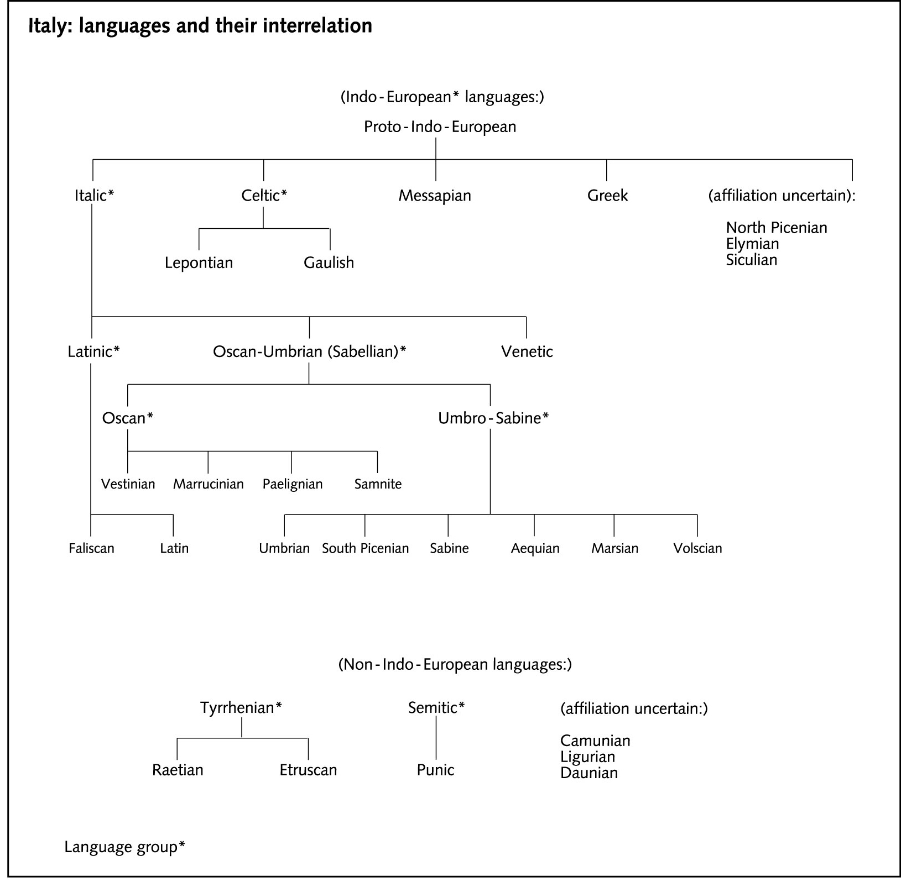
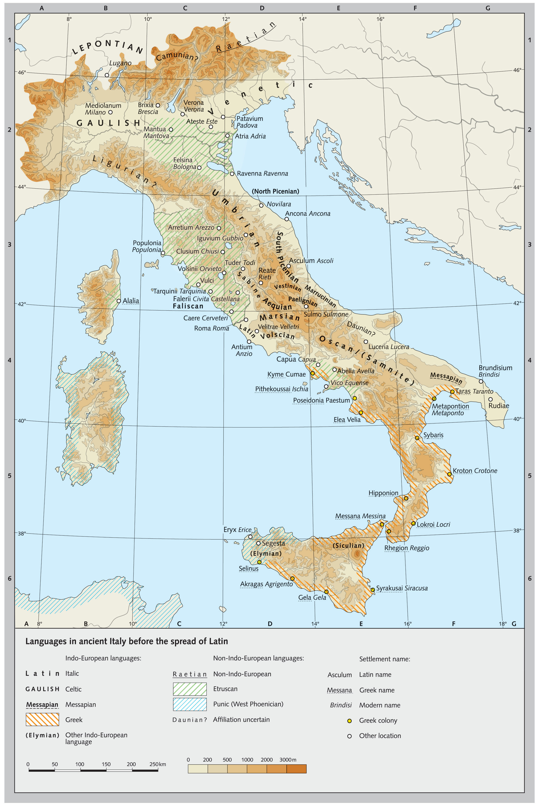
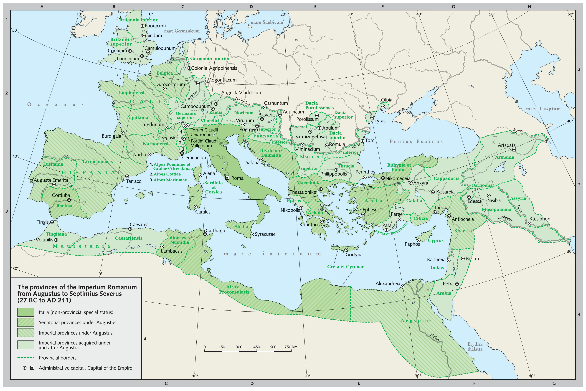

# SALVETE!

## Welcome to a new language: Latin!

- Latin is the language of ancient Latium, now Lazio, the region around Rome.
- With the expansion of Roman power, Latin was spoken in various forms across Europe. Very often it developed into what are now known as the Romance Languages.

---

<!--Note: maps are from Brill's New Pauly. -->

---

---

---

- Classical Latin, even more than Classical Greek, was for many centuries a central part of the education of European elites. As a consequence, its contribution to scientific language has been immense.

---

- We will learn Latin bases, suffixes and prefixes in just the way in which we learned those coming from Greek.
- We will also, however, learn real Latin nouns and adjectives, since sometimes these occur on their own in scientific writing.

---

- Latin bases sometimes occur in English on their own, with or without an extra final *-e*:
    - FORT-, ‘strong’ – fort
    - VERB-, ‘word’ – verb
    - GRAV-, ‘heavy’ – grave
- More often, bases are combined with prefixes and suffixes:
    - in-, ‘on’ + GRAV-, ‘heavy’ + esc-, ‘to become’ + -ent, ‘-ing’ = ingravescent
    - FIN-, ‘end’ + -al, ‘pertaining to’ + -ity, ‘state of’ = finality

---

- Connecting vowels in Latin are most often *i* or *o*, but other vowels can be used:
    - SACR-, ‘sacred’ + i + FIC-, ‘to make’ + -e = sacrifice
    - SACR- + o + SANCT-, ‘sacred’ = sacrosanct
- Greek and Latin prefixes, suffixes and bases sometimes combine, but not nearly as often as they combine within each group:
    - AUTO- (Gr. ‘self’) + MOB- (Lat. ‘to move’ + -ile = automobile
    - hyper- (Gr. ‘over’) + TENS (Lat. ‘to stretch’) + ion = hypertension

## Phonetic Change
- Often when a prefix is added to a base that starts with a consonant, the last consonant of the prefix is ‘assimilated’ to the first consonant of the base.
    - ex-, ‘from’ + FECT-, ‘to make’ = effect
    - in-, ‘not’ + LEG-, ‘to read’ + -ible = illegible
    - ob-, ‘against’ + FEND-, ‘to hit’ = offend
    - sub-, ‘under’ + FER-, ‘to bear’ = suffer

---

- A final *n* in a prefix will become *m* before a *p* or a *b*.
    - in-, ‘not’ + POSS, ‘to be able’ + -ible = impossible
    - con-, ‘with’ + PLET + e = complete
- Sometimes the base itself will change when a prefix is added. You will learn these variant forms as you learn bases.
    - FACT- gives ‘factory’ and ‘manufacture’, but also ‘effect’ and ‘defect’
    - SED- gives ‘sedentary’, but also ‘reside’

# Prefixes

## ab-, a-, abs-
- ‘away from’, ‘from’
- abduction, abnormal, aversion, avocation, abstraction, abstain

## ad-, ac-, ag- (etc.)
- ‘to’, ‘toward’, ‘near’
- adrenal, adverb, access, aggression, alleviate
- NB: Assimilation will cause the last consonant of this prefix to become the same as the first consonant of the root.

## ambi-, ambo-
- ‘both’, ‘around’
- ambidextrous, ambition, ambisexual, amboceptor, ambosexual

## ante-
- ‘before’, ‘in front of’
- antechamber, antecedent

## circum-, circu-
- ‘around’
- circumference, circumstance, circuitous

## con-, com-, co-, etc.
- ‘with’, ‘together’, ‘very’
- conduct, confine, compose, compress, correspond, cooperate, collect
- NB: Assimilation will cause the last consonant of this prefix to become the same as the first consonant of the root.

## contra-, contro-
- ‘opposite’, ‘against’ (through French, counter-)
- contradict, contraceptive, controversy, controvert, counteract, counterindicate

## de-
- ‘down’, ‘away’, ‘off’, ‘thoroughly’
- describe, descend, depression

## dis-, di-, dif-
- ‘apart’, ‘in different directions’, ‘thoroughly’
- dissect, dispersion, divorce, digress, divert, differ, diffusion

## ex-, e-, ef-
- ‘out’, ‘from’, ‘removal’, ‘completely’
- exclude, expel, exclamation, emit, elect, elongate, effective
- NB: after ex- an initial s in a root sometimes disappears, as in ex-(S)PECT and ex-(S)PIRE.

## extra-, extro-
- ‘outside of’, ‘beyond’
- extraordinary, extrasensory, extrovert

## in-, im-, etc.
- ‘into’, ‘on’ (through French, *en-*)
- incision, induce, illuminate, imprint, irrigation, enclose
- NB: Assimilation will cause the last consonant of this prefix to become the same as the first consonant of the root.

## intra-, intro-
- ‘within’
- intramural, introduce, introvert

## in-, im-, etc.
- ‘not’
- infirm, inefficient, impossible, illegible, irresponsible
- NB: Assimilation will cause the last consonant of this prefix to become the same as the first consonant of the root.

## infra-
- ‘below’
- infrared, infrahuman, infraspecific

## inter-
- ‘between’, ‘among’
- interrupt, intercept, interact

## juxta-
- ‘by the side of’, ‘close to’
- juxtaposition, juxtaspinal

## ob-, etc.
- ‘against’, ‘toward’, ‘completely’
- obstruct, obstacle, obvious, oppose, offer, occur
- NB: Assimilation will cause the last consonant of this prefix to become the same as the first consonant of the root.

## per-
- ‘through’, ‘wrongly’, ‘completely’
- perfect, permeate, pervade, perjury

## post-
- ‘behind’, ‘after’
- postpone, postscript, postgraduate

## pre- (prae-)
- ‘before’, ‘in front of’
- prevent, prepare, precaution, praenomen, praetorian

## pro-
- ‘forward’, ‘in front of’
- progress, project, prolong

## re-, red-
- ‘back’, ‘again’, ‘against’
- reduce, reject, recede, redundant, redemption

## retro-
- ‘backwards’, ‘behind’
- retroactive, retrospective, retrograde

## se-
- ‘aside’, ‘away’
- secede, select, secrete

## sub-, sus-, suc-, etc.
- ‘under’, ‘up from under’, ‘somewhat’
- submarine, subscribe, submerge, suspend, suffer, support
- NB: Assimilation will cause the last consonant of this prefix to become the same as the first consonant of the root.

## super-, supra-
- ‘above’
- supernatural, superstructure, supersonic, suprarenal

## trans-, tran-, tra-
- ‘across’, ‘through’
- transmit, transfer, transfusion, transcribe, transcend, trajectory, travesty, tradition

## ultra-
- ‘beyond’
- ultraviolet, ultramodern, ultrasonic

# The Latin Alphabet

## 23 Letters

A	B	C	D	E	F	G	H	I	K	L	M	N	O	P	Q	R	S	T	V	X	Y	Z

- I and J, U and V were treated as the same character in writing, but in the Middle Ages they were pronounced differently.
- W was a medieval invention (literally a double U).

---

---

---

](../images/P.Mich.inv.-4301.jpg)

# Roots, Part I

## CAUD-
- ‘tail’ (*cauda*)
- e-CAUD-ate, without a tail; NUDI-CAUD-ate, having a tail not covered with hair or fur; SACRO-CAUD-al, pertaining to the sacrum and tail region

## CEREBR-
- ‘brain’ (*cerebrum*)
- CEREBR-al; CEREBR-in, a nitrogenous glycoside obtained from brain and similar tissue

## CID-, CIS-
- ‘to cut’, ‘to kill’
- MATRI-CIDE; REGI-CIDE; CON-CISE; suc-CISE, abrupt, appear as if a part were cut off; in-CIS-ura, a notch, depression or indentation, as in bone, stomach, liver, etc.

## DORS-
- ‘back’
- ante-DORS-al, situated in front of the dorsal fin in fish; DORS-ALG-ia, pain in the back; DORSO-CAUD-ad, to or toward the dorsal surface and caudal end of the body

## DUC-, DUCT-
- ‘to lead’, ‘to draw’
- DUCT; de-DUCT-ion; ab-DUCT-ion, withdrawal of a part from the axis of the body or of an extremity; LEVO-DUCT-ion, movement to the left, especially of the eye

## ERR-
- ‘to wander’, ‘to deviate’
- ERR; ERR-or; ERR-ata; ERR-ant, with a tendency toward moving, straying or deviating

## FLEX-, FLECT-
- ‘to bend’
- re-FLECT-ion; re-FLEX, an involuntary, invariable, adaptive response to a stimulus; retro-FLEX-ion, the state of being bent backwards

## FUND-, FUS-
- ‘to pour’, ‘to melt’ (through French, FOUND-)
- FUS-ion; dif-FUSE, spread out; per-FUS-ion, the introduction of fluids into tissues by their injection into arteries, or the passage of fluids through spaces

## GREG-
- ‘flock’, (*grex*)
- con-GREG-ate; se-GREG-ate; e-GREG-ious; GREG-arious, tending to herd together, or growing in clusters

## LACT-
- ‘milk’ (*lac*)
- LACT-at-ion, the period during which the child is nourished from the breast, or the formation or secretion of milk; LACTI-FER-ous, forming or carrying milk

## LATER-
- ‘side’ (*latus*)
- LATERI-GRADE, walking sideways, as a crab; ambi-LATER-al, relating to or affecting both sides; HETERO-LATER-al, pertaining to or situated on the opposite

## MEDI-
- ‘middle’ (*medius*)
- MEDI-ate; MEDIO-DORS-al, on the median line of the back

## OV-
- ‘egg’ (*ovum*)
- OV-ul-at-ion; BIN-OV-ular, pertaining to two ova, applies to twinning; OVI-CIDE, an insecticide effective against an egg stage

## PON-, POSIT-, -POSE
- ‘to place’, ‘to put’ (through French, POUND-)
- ex-PON-ent; im-POUND; ap-POSIT-ion, the state of being in juxta-POSIT-ion or proximity; trans-POSIT-ion, a change of position

## RUG-
- ‘wrinkle’ (*ruga*)
- RUGA, a fold or wrinkle, as of the mucous membrane of certain organs; RUG-os-ity, a condition exhibiting many folds in a tissue or integument

## SANGUI(N)-
- ‘blood’ (*sanguis*)
- SANGU-ine; SANGUI-MOT-or, of or relating to the circulation of blood; con-SANGIN-eous, related by birth or blood

## SICC-
- ‘dry’ (*siccus*)
- ex-SICC-ata, dried specimens; ex-SICC-ant, drying or absorbing moisture; SICC-ant, drying, tending to make dry

## VAL-
- ‘to be strong’, ‘to be well’
- VAL-id; VALE-DICT-ory; bi-VAL-ent, applies to paired homologous chromosomes; VAL-ence, capacity of atoms to combine with other atoms in different proportions

## VARIC-
- ‘twisted and swollen (vein)’ (*varix*)
- VARIC-ose, descriptive of blood vessels that are dilated, knotted and tortuous; NEURO-VARIC-osis, a varicosity on a nerve fibre; VARIX (pl. varices), prominent ridges across the whorls of univalve shells; VARIC-eal, relating to or involving a varix; VARICO-cele, a mass of varicose veins in the spermatic cord

## VERT-, VERS-
- ‘to turn’
- VERTEX, the highest point (Latin 'whirlpool, crown of a head'), from which the word *vertical* comes; a-VERS-ion; VERS-at-ile, hung or attached near the middle and moving freely, as an anther; VERSI-COLOUR-ed, changing from one colour to another in different lights

# Hybrid Words

## Dirckx (1977)

- Some scientists have periodically raised the opinion that words combining multiple languages should not exist.
- In fact, Latin borrowed from Greek even in classical times.
- Much of our medical terminology originates with writings attributed to Hippocrates (of the Hippocratic Oath; ca. 460–ca. 370 BC).
- Celsus (first century AD) is a major source for early Roman usage of medical terminology.

---

- Thus, Latin suffixes have often used on Greek roots, especially since the Middle Ages:
    - e.g. *pterygion* and *teinesmos* became *pterygium* and *tenesmus*
    - Greek adjectival endings took on Latin form: *kardiakos* becoming *cardiacus*
    - Latin adjectival suffixes began to be appended to Greek nouns, as in *arterialis*, from *arteria*.

---

- Conversely, Greek suffixes such as *-itis*, *-osis*, and *-otomía* have been used with Latin roots:
    - conjunctivitis
    - granuloma
    - tuberculosis
- Greek prefixes were also attached to Latin stems (epidural, pararectal) and Latin prefixes to Greek stems (subdiaphragmatic, retropharyngeal).

---

- The combination of Greek and Latin stems in a single word did not nonetheless become common until the nineteenth century; there is still some debate over this.
- Thus, we have both phlebography (pure Greek) and venography (Latin/Greek).

# Roots, Part II

## ARTICUL-
- ‘joint’ (*articulus*)
- inter-ARTICUL-ar, between articulating parts of bones (applies to certain ligaments and fibrocartilages); BI-ARTICUL-ar, two-jointed

## BUCC-
- ‘cheek’, ‘mouth’ (*bucca*)
- BUCC-al, relating to the cheek or mouth; BUCCO-LINGU-al, pertaining to the cheeks and tongue; BUCCO-VERS-ion, condition of tooth’s being out of the line of the normal occlusion in the buccal direction

## CLUD-, CLUS-, CLOS-
- ‘to close’, ‘to shut’
- con-CLUDE; in-CLUS-ive; e-CLOS-ion, the act of emerging from the pupal case, or of hatching from the egg; ex-CLUS-ion, the process of shutting out in a surgical operation by which part of an organ is disconnected but not excised

## CORD-
- ‘heart’ (*cor*)
- ac-CORD; con-CORD; CORD-ate, heart-shaped; sub-CORD-ate, tending to be heart-shaped; post-CORDI-al, situated behind the heart; pre-CORD-ium the area of the chest overlying the heart

## COST-
- ‘rib’ (*costa*)
- COST-ate, with one or more longitudinal ribs or ridges; BI-COST-ate, having two longitudinal ridges or ribs, as a leaf; sub-COST-ALG-ia, pain beneath the ribs or over a subcostal nerve

## CRUR-
- ‘leg’ (*crus*)
- CRURA (pl. of CRUS); the shanks, or leg-like or columnar structures GENITO-CRUR-al, pertaining to genitalia and leg

## CUR(R)-, CURS-
- ‘to run’, ‘to go’
- CURR-ent; oc-CUR; con-CUR; ex-CURR-ent, pertaining to ducts, channels or canals where there is an outgoing flow, or with an undivided main stem, or having midrib projecting beyond the apex

## DENT-
- ‘tooth’ (*dens*)
- in-DENT; TRI-DENT; DENT-ition, the process of teething, or the arrangement of the teeth; DENT-in, a hard, elastic substance, chemically resembling bone, composing the greater part of teeth; DENT-icle, a small, toothlike process

## FEBR-
- ‘fever’, (*febris*)
- FEBR-ile, pertaining to or characterized by fever; FEBR-icula, a slight and transient fever

## FER-
- ‘to bear’, ‘to carry’, ‘to produce’
- suf-FER; re-FER; trans-FER; af-FER-ent, bringing toward (applies to nerves carrying impulse to nervous centres); OVI-FER-ous, serving to carry eggs; PROLI-FER-ate, to multiply

## FOLI-
- ‘leaf’ (*folium*)
- FOLI-age; FOLI-aceous, having the form or texture of a foliage leaf; pre-FOLI-at-ion, the form and arrangement of foliage leaves in a bud; ef-FOLI-at-ion, shedding of leaves

## HER-, HES-
- ‘to stick’
- ad-HER-ent, attached to a substratum; co-HES-ion, the attractive force between the same kind of molecules; ad-HESIO-tomy, the surgical cutting or division of adhesions

## JECT-
- ‘to throw’, JACUL-, ‘dart’ (*jaculum*)
- e-JECT; re-JECT; pro-JECT-ile; OVI-JECT-or, a highly muscular part of the oviduct in many nematode worms that forces the eggs through the genital pore; JACULAT-ory, darting out, capable of being emitted

## MUR-
- ‘wall’ (*murus*)
- inter-MUR-al, situated between the walls of an organ; extra-MUR-al, outside the wall of an organ; MUR-al, pertaining to a wall, as a mural pregnancy

## NOMIN-, NOM-
- ‘name’ (*nomen*)
- NOMIN-al; NOMINAL-ism; para-NOM-ia, nominal aphasia, characterized by an inability name objects; BI-NOM-ial, consisting of two names

## RADI-
- ‘spoke of a wheel’, ‘ray’ (*radius*)
- RADI-ate; RADIO-re-CEPT-or, a terminal organ for receiving light or temperature stimuli; RADI-ole, a spine of a sea urchin; RADIO-therapy treatment of disease by x-rays, radium and other radioactive substances

## SEMIN-
- ‘seed’ (*semen*)
- dis-SEMIN-at-ion; SEMIN-al; SEMIN-at-ion, dispersal of seeds, discharge of spermatozoa; SEMIN-uria, discharge of semen in the urine

## TEG-, TECT-
- ‘to cover’
- pro-TECT; de-TECT; TEG-men, the inner seed coat, or a covering structure or roof, esp. the thin plate over the tympanic atrium; sub-TEG-min-al, under the tegmen or inner coat of a seed

## TUSS-
- ‘cough’ (*tussis*)
- TUSS-ive, pertaining to or caused by a cough; TUSS-ilago, a genus of plants used as a remedy for cough

## VEN-
- ‘vein’ (*vena*)
- RECTI-VEN-ous, having straight veins; VEN-at-ion, the system or disposition of veins; VEN-ule, small vein of a leaf or insect wing

# [A ‘Terror of Tyrannosaurs’](http://www.plosone.org/article/info%3Adoi%2F10.1371%2Fjournal.pone.0103613)

## Your Words

- pathology
- tyrannosaurids, tyrannosauridae
- gregariousness
- palaeontology
- locomotion, locomotor
- oviraptorosaurian
- osteology, osteological
- ichnologic, ichnofamily
- metatarsus
- proximodistal
- daspletosaurus
- *Gorgosaurus libratus*
- phalanges

---

- tibiotarsus
- astragalus
- tridactyl
- mesaxonic
- palaeoichnological
- Cretaceous
- theropod
- intertarsal

# Roots, Part III

## ARBOR-
- ‘tree’ (*arbor*)
- ARBOR-eous, treelike or pertaining to trees; ARBOR-iz-at-ion, a conformation or arrangement resembling the branching of a tree

## CAL-
- ‘to be warm’
- CALE-FACI-ent, an externally applied medicine that causes a sensation of warmth; de-CAL-esc-ence, the decrease in temperature when rate of heat absorption exceeds rate of heat input

## CARIN-
- ‘keel’ (*carina*)
- CARINA, any keel-like structure, as at the tracheal bifurcation; para-CARIN-al, beside a carina, especially the urethral carina

## CERN-, CRET-, CRE-
- ‘to separate’, ‘to distinguish’, ‘to secrete’
- se-CERN-ment, secretion, applied to the function of a glad; in-CRET-ion, internal secretion, se-CRET-agogue, substance promoting or causing secretion

## CILI-
- ‘eyelid’, ‘eyelash’ (*cilium*)
- super-CILI-ous; CILIA, hairlike, vibratile outgrowths of the ectoderm; CILI-ata, a class of phylum Protozoa characterized by the presence of cilia; CILIO-GRADE; progressing by movement of cilia

## CORN(U)-
- ‘horn’ (*cornu*)
- CORNU-COPIA; UNI-CORN; BI-CORNU-te, with two hornlike processes; CAVI-CORN, hollow-horned, applies to some ruminants; CORNI-FIC-ation, degenerative process by which cells of epithelium are converted into dead, horny tissue

## CUB-, CUMB-, CUBIT-
- ‘to lie’
- suc-CUMB; in-CUMB-ent; in-CUB-us; pro-CUMB-ent, prone, lying face down (in dentistry, said of a tooth whose long axis approaches the horizontal); suc-CUB-ous, with each leaf covering part of the leaf beneath it

## DORM-, DORMIT-
- ‘to sleep’
- DORMIT-ory; ob-DORMIT-ion, numbness of a part due to interference with nervous function, sensation of a part ‘being asleep’; DORMIT-ive, inducing sleep

## FET- (FOET-)
- ‘offspring’ ‘fetus’
- FET-at-ion, the formation of a fetus, pregnancy; ex-FET-at-ion, extopic or extrauterine pregnancy

## FRANG- (-FRING-), FRAG-, FRACT-
- ‘to break’, ‘to bend’
- FRACT-ion; FRAG-ment; FRACT-ure; re-FRACT, to cause the deviation of a ray of light from a straight line in passing obliquely from one transparent medium to another of different density

## GRAD-, GRESS-
- ‘to step’, ‘to go’
- DIGITI-GRADE, walking with only digits touching the ground; ORTHO-GRADE, walking or standing in the upright position; sub-PLANTI-GRADE, incompletely plantigrade, walking with the heel slightly elevated

## LINGU-
- ‘tongue’, ‘language’ (*lingua*)
- LINGU-ist-ics; BI-LINGU-al; FISSI-LINGU-al, having a bifid or cleft tongue; LINGUO-VERS-ion, displacement of a tooth on the lingual side of its proper occlusion

## MENT-
- ‘chin’ (*mentum*)
- MENT-al, pertaining to the chin; sub-MENT-al, beneath the chin; MENT-alis, a muscle of the lower lip

## PLIC-, PLICIT-
- ‘to fold’
- PLICA, a fold of skin or membrane; com-PLIC-ate, folded (said of leaves or of insect wings); PLIC-at-ion, the act or process of folding

## POT-
- ‘to be powerful’
- POT-ent-ial; OMNI-POT-ent; UNI-POT-ent, giving rise to only one cell or tissue type (said of an embryonic or multiplying cell); POT-ent-at-ion,effect of a substance which, when, added to another, makes the latter more potent as a drug

## PUR-
- ‘pus’ (*pus*)
- PUR-ulent, containing, consisting of, or forming pus; sup-PUR-ate, to form pus; PURO-HEPAT-itis, suppurative inflammation of the liver

## REN-
- ‘kidney’ (*ren*)
- ad-REN-al, adjacent to the kidneys, or relating to or derived from adrenal glands or their secretion; sub-RENI-form, slightly kidney-shaped; RENO-TROP-ic, specifically attracted to kidney tissue

## SON-
- ‘sound’ (*sonus*)
- ultra-SON-ic, pertaining to sounds with a frequency above that of audible sound; SONI-FIC-at-ion, the act or process of producing sounds, as stridulation of insects

## SUD-
- ‘to sweat’
- ex-SUD-at-ion, process of oozing out slowly; SUDORI-FIC, inducing sweating; SUD-at-orium, a hot air bath or a room for such a bath

## TRUD-, TRUS-
- ‘to push’, ‘to thrust’
- in-TRUDE; in-ob-TRUS-ive; ex-TRUS-ion, a forcing out (in dentistry, extension of a tooth beyond the occlusal plain)